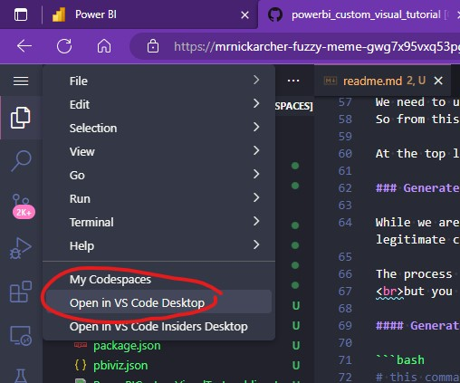
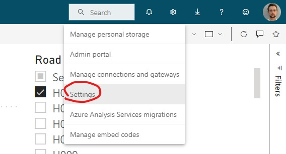
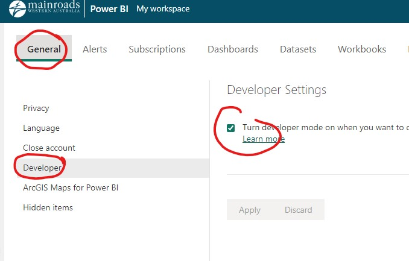
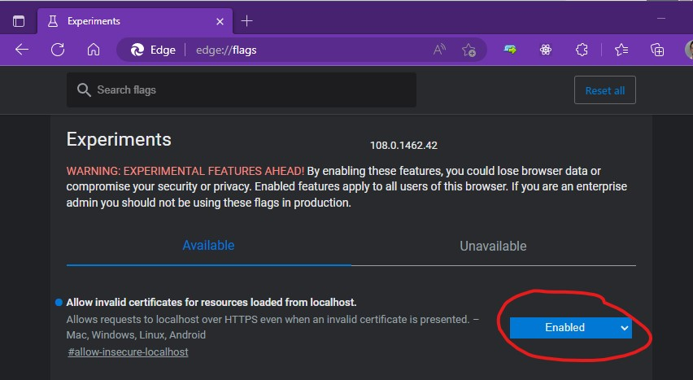
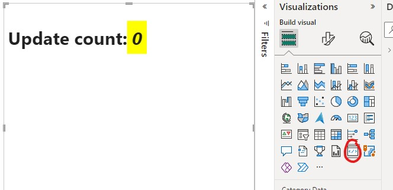

# Tutorial - Custom Visual for PowerBI <!-- omit from toc -->

- [1. Session 1 - Setup](#1-session-1---setup)
  - [1.1. 🔱 Fork this repository!](#11--fork-this-repository)
  - [1.2. Start a Codespace](#12-start-a-codespace)
  - [1.3. Open Terminal](#13-open-terminal)
  - [1.4. Open the Codespace in Desktop Visual Studio Code](#14-open-the-codespace-in-desktop-visual-studio-code)
  - [1.5. Run the Visual](#15-run-the-visual)
  - [1.6. Open PowerBI Portal](#16-open-powerbi-portal)
  - [1.7. Create a new Report](#17-create-a-new-report)
  - [1.8. Save your new report](#18-save-your-new-report)
  - [1.9. Enable developer mode visuals in settings](#19-enable-developer-mode-visuals-in-settings)
  - [1.10. Enable Edge/Chrome Support for HTTPS / Local Host](#110-enable-edgechrome-support-for-https--local-host)
  - [1.11. Add the development mode visual to the report](#111-add-the-development-mode-visual-to-the-report)
  - [1.12. Generate and install a certificate (MAYBE NOT REQUIRED)](#112-generate-and-install-a-certificate-maybe-not-required)
    - [1.12.1. Generate a certificate (MAYBE NOT REQUIRED)](#1121-generate-a-certificate-maybe-not-required)
    - [1.12.2. Copy the certificate (MAYBE NOT REQUIRED)](#1122-copy-the-certificate-maybe-not-required)
    - [1.12.3. Install the certificate (MAYBE NOT REQUIRED)](#1123-install-the-certificate-maybe-not-required)
- [2. Session 2 - Modifying the visual Template](#2-session-2---modifying-the-visual-template)
  - [2.1. A tour of the repo so far](#21-a-tour-of-the-repo-so-far)
  - [2.2. a small change and a refresh](#22-a-small-change-and-a-refresh)
  - [2.3. Update `capabilities.json`](#23-update-capabilitiesjson)
  - [2.4. drawing somethign](#24-drawing-somethign)


We will be roughly following the following tutorial in the microsoft documentation:

<https://learn.microsoft.com/en-us/power-bi/developer/visuals/develop-power-bi-visuals>

## 1. Session 1 - Setup

### 1.1. 🔱 Fork this repository!

Use Github to fork this repository

### 1.2. Start a Codespace

The following are already installed in the codespace:

- `NodeJS` is installed;
  - This lets javascript run outside of the browser, like python.
- `npm` is installed
  - This is like python's `pip` package installer
- Required libraries are pre-installed
  - Such as `Typescript`, `Webpack` etc
- `pbiviz` is installed
  - This is Microsoft's helper tool which they provide for developing custom visuals

These are all pre-installed thanks to the configuration file inside the `/.devcontainer` folder.

### 1.3. Open Terminal

First we create a new visual named `mychart`

```bash
pbiviz new mychart
```

This generates a new visual template inside a folder called `/mychart/`.

We would prefer it is not in this subfolder; so we need to either

- manually move all files out of the folder using VSCode's explorer
- OR run the following two lines in the terminal:

```bash
# move files out of mychart subfolder (include items starting with `.`, like the .vscode folder)
mv -f mychart/{.*,*} .
```

```bash
# delete the mychart folder
rmdir mychart
```


### 1.4. Open the Codespace in Desktop Visual Studio Code

We need to use some special features of the desktop version of visual studio code.
So from this point we cant use the browser based vscode editor.



### 1.5. Run the Visual

Open the terminal in vscode desktop and type

```bash
pbiviz start
```

### 1.6. Open PowerBI Portal

Visuals cannot be previewed in PowerBI desktop during development.

To see the running visual we need to create a report in the PowerBI portal.

You can use this link <https://app.powerbi.com/home>

### 1.7. Create a new Report

From the portal create a new blank report

 1. Select `Paste or manually enter data`
 2. Select and paste the following data using `Ctrl+C` then `Ctrl+V`:

```text
Road	Carriageway	SLK From	SLK To	Offset	Colour (CSS)
H001	LRS	3	5	0	cyan
H015	L	0	2	-10	yellow
H016	L	4	8	-10	magenta
H016	L	4	7	-20	magenta
```

3. Click use first row as headers
4. Click create report

### 1.8. Save your new report

Click File Save to save your report and give it a name.

Store it in `My Workspace` to keep it in your own workspace.

### 1.9. Enable developer mode visuals in settings

1. In the top right select settings
2. Under developer tick the box to enable development mode visuals




### 1.10. Enable Edge/Chrome Support for HTTPS / Local Host

Since we are loading secure HTTPS from vscode/localhost, we need to relax a security setting in edge or chrome to allow development:



This setting only applies to things loaded from your own machine and does not affect normal web browsing security.

You may see some warnings from your browser:

<details>

<summary>Click here for detailed explanation</summary>

Normally your browser would not allow data served from your own PC (`localhost`)
to be considered secure `HTTPS`. This is because `HTTPS` requires thats data is
served from a registered unique domain name such as `google.com` or
`app.powerbi.com`. In our case the custom visual is

- served on the codespace,
- forwarded and served on your local computer by visual studio code
  <br>(try open <https://localhost:8080/assets>)
- loaded from your local machine onto your report in the portal (at `https://app.powerbi.com/...`)

Even though the entire process is encrypted and served over HTTPS
and the traffic to and from the visual is safe,
your browser unable to verify the HTTPS connection because
it does not come from a registered domain name.

</details>

### 1.11. Add the development mode visual to the report

Back in your new report

1. Click the edit button to go into edit mode
2. Create a new page
3. Thens select the development mode visual



You should now see development mode visual with `Update count:` as shown in the screenshot above.

### 1.12. Generate and install a certificate (MAYBE NOT REQUIRED)

<details>

<summary>Click here to expand instructions if the process above did not work </summary>

While we are developing the visual, we need to provide evidence to our computer that it is talking to a legitimate custom visual source.

The process is slightly more complicated than usual because we are working in a codespace
<br>but you can do it! :)

</details>

#### 1.12.1. Generate a certificate (MAYBE NOT REQUIRED)

<details>

<summary>Click here to expand instructions if the process above did not work </summary>

```bash
# this command generates the certificate file and prints out the location to the terminal
# it does not actually install anything because we are in a codespace
pbiviz --install-cert
```

</details>

#### 1.12.2. Copy the certificate (MAYBE NOT REQUIRED)

<details>

<summary>Click here to expand instructions if the process above did not work </summary>

```bash
# this command copies the certificate to our working directory so that we can download it
# note that you may need to modify the command below to reflect what was printed out by the previous command
cp /usr/local/share/nvm/versions/node/v19.6.0/lib/node_modules/powerbi-visuals-tools/certs/PowerBICustomVisualTest_public.crt .
```

Then use the explorer in visual studio code to download the `PowerBICustomVisualTest_public.crt` file

</details>

#### 1.12.3. Install the certificate (MAYBE NOT REQUIRED)

<details>

<summary>Click here to expand instructions if the process above did not work </summary>

Once downloded, double click `PowerBICustomVisualTest_public.crt` and

1. Click Install Certificate button
2. Select current user
3. Place in the following store
4. Browse and select `Trusted Root Certification Authorities`
5. Finish

</details>

## 2. Session 2 - Modifying the visual Template

### 2.1. A tour of the repo so far

*Under Construction*

### 2.2. a small change and a refresh

*Under Construction*

### 2.3. Update `capabilities.json`

*Under Construction*

### 2.4. drawing somethign

*Under Construction*
